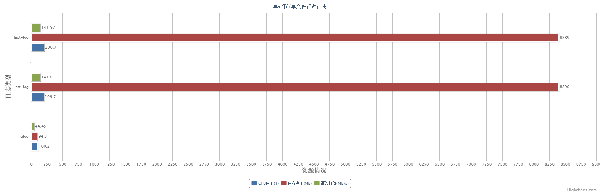
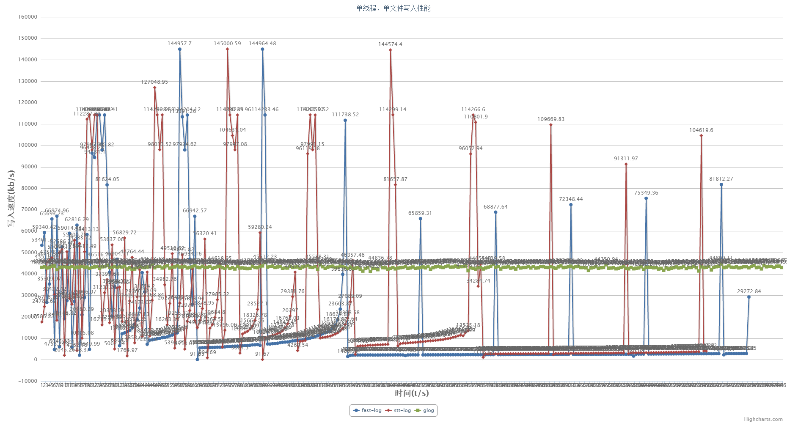
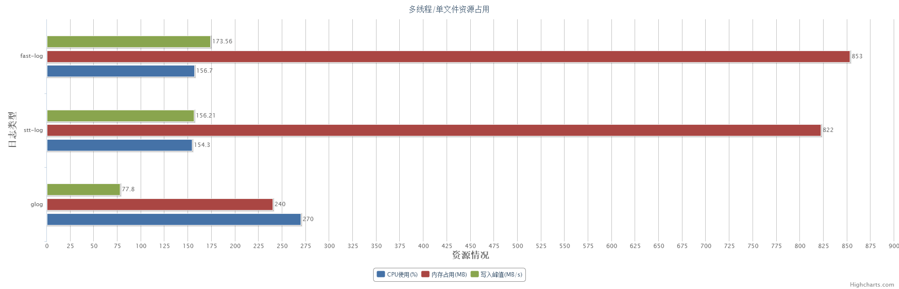
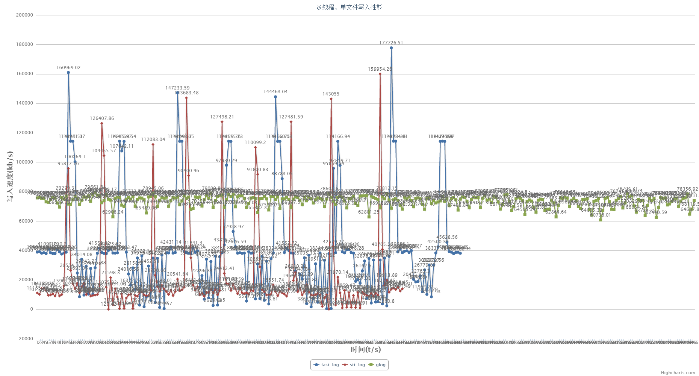
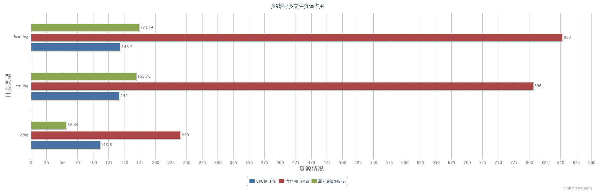
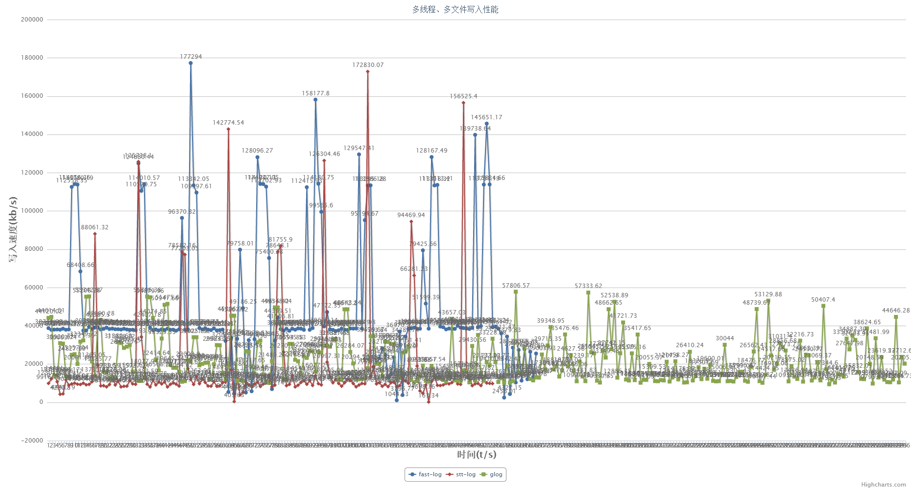

# 日志性能测试

## 测试框架思路

1. 在写日志的线程中设置中断点，然后不断写入,控制线程启动写线程后，休眠指定的时间，然后中断写线程,
写线程捕获到中断事件(thread_interrupted)，进行日志flush处理。实现运行指定时间的写入。

2. 由于stt日志级别高的会使得级别低的不打印，FLOW级别默认打印，所以ERROR是在测试写入文件数2时的设置标志(ERROR是在测试写入文件数2时的设置标志
使得DEBUG等都不打印)

3. stt_xxx_log需要准确匹配中断事件，才能保证flush日志处理会在主线程结束之前完成

4. 中断点设置一次，放置在while(true)之前，依旧可以被触发，避免循环设置断点

5. 设置日志级别，未屏蔽的日志函数就可以使用,屏蔽的日志级别打印无效果

6. 写入日志的flush时机是随机的，因此可能会出现某一时刻，IO速度大幅变化的情形

## glog使用

1. glog日志级别有`info`,`warning`,`error`,`fatal`四个级别,`fatal`会触发程序停止

2. glog设置stderr到`FATAL`可不打印非出错日志到标准输出

## 测试源码

- `src`文件中
- `xxx_single`为单线程写入单文件测试用例
- `xxx_same`为多线程写入单文件测试用例
- `bench_xxxlog`为多线程写入多文件测试用例

## 测试结果

### 测试对象`tl_fast_log`,`stt_error_log`,`glog`

### 单文件/单线程测试

| 日志类型   |  运行时间(min) | CPU使用率(%) | 内存占用(MB) | 写入峰值(MB/s) |
| :--------: | :----:  | :----: | :-----: | :-----: | :-----: |
| fast_log | 5 | 200.3 | 8389+ | 141.57 | 
| stt_log | 5 |  199.7 | 8390+  | 141.60  |
| glog |   5  |  100.2 | 94.3 | 44.45 |

- 资源占用

- 写入性能

### 单文件/多线程测试

| 日志类型   |  运行时间(min)  | 线程数 | CPU使用率(%) | 内存占用(MB) | 写入峰值(MB/s) |
| :--------: | :----:  | :----: | :-----: | :-----: | :-----: |
| fast_log | 5 |  5  | 156.7 | 853 | 173.56 | 
| stt_log | 5 |  5  |  154.3 | 822  | 156.21  |
| glog |   5   |  3  |  270.0 | 240 | 77.80 |

- 资源占用

- 写入性能

### 多文件/多线程测试

| 日志类型   |  运行时间(min) | 线程数 | 写入日志数 | CPU使用率(%) | 内存占用(MB) | 写入峰值(MB/s) |
| :--------: | :----:  | :----:  | :----: | :-----: | :-----: | :-----: |
| fast_log | 5 |  5 | 5 | 143.7 | 853 | 173.14 | 
| stt_log | 5 |  5 | 5 |  142.0 | 806  | 168.78  |
| glog |   5 | 3 |6  |  110.8 | 240 | 56.45 |

- 资源占用

- 写入性能

## 结果分析

- fast_log在没有flush之前日志一直在内存中，如果不及时flush到文件中,随着时间的增长，内存占用越来越大
- stt_error_log串行写单日志文件效率较高
- 同时写多个日志文件，tl_fast_log的效率较高,但是性能表现不稳定
- 并发写日志情况下,stt_error_log与tl_fast_log峰值相差不大，但是平均性能tl_fast_log较好,二者系统抖动都比较明显，没有glog稳定
- glog在各种测试环境下写入性能和资源占用都比较稳定,性能比较不突出
