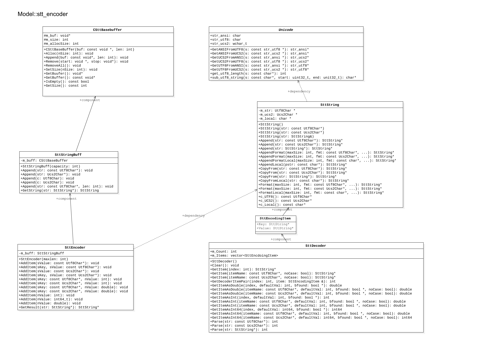

# stt_encoder使用手册

## 初次分析源码

1. 工程是静态链接
2. 结构图 ，调用关系 --已完成
3. 转码工作原理,总体概述
4. 内部统一成按需求存储为UTF-8和UTF-16两种编码
5. SttStringBuff内部按照(key,value)方式存储
6. SttStringBuff <- CSttBaseBuffer
7. SttString <- Utf8char,Ucs2Char,char指针
8. 具体类的结构、类之间的关系可以参考UML结构图
9. 递归调用Parse，根据返回值可以区分出基本对象成员(不可再分)和list项(可再分)

## 原理

- stt_encoder使用key,value方式存储数据
- stt_encoder是添加特殊符号分割字段来实现




## 使用方法

### Encode

- 创建SttEncoder对象,然后AddItem添加key-value键值对
- 对字符串的项使用Unicode工具转换为UTF-8编码字符串
- 编码一个单元，使用GetResult获取其系列化后的SttString
- 将形成的序列化对象按需求使用key-list方式包裹起来传递 

### Decode

- 创建SttDecoer对象,以及SttEncodingItem键值对
- 逆向Encode操作,Parse获取对象中的Item和ItemSize
- 对每一个Item可以继续Parse，以分解成最小的单位
- 按照Encode操作的对象结构重新组织，即反序列化完成对象的重建


## 进阶

- 编码替换规则

```c++
/       =>      @S
@       =>      @A

key,value分隔   @=
结尾             /
```

- 解码还原规则

```
@A      =>       @
@S      =>       /
@=      =>       key,value分隔
```

- 编解码都是字符串方式存储，因此，每次遇到之前编码的字符串，都会发生上述的替换规则，
每次解码，都会发生字符串还原

- 编码类似压栈操作，每次碰到特殊字符，符合规则都会发生替换
- 解码类似出栈操作，每次碰到特殊字符，符合规则就会发生还原

### 二义性问题

```bash
@/xxx@/  字符串会在编码之后，再解码被截断
```